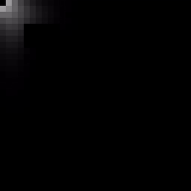

# 2DPrototypes
Random 2d prototypes of ideas I come up with.  
None of this code is meant to be ultra-quality and will typically be a bit messy.  

## 2DCellularLightingRaylib
A 2D implementation of a volumetric cellular automata based lighting algorithm.  

